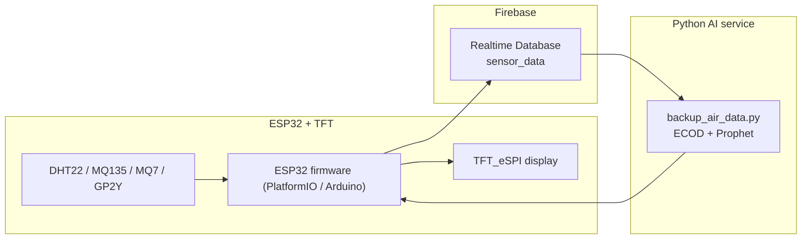
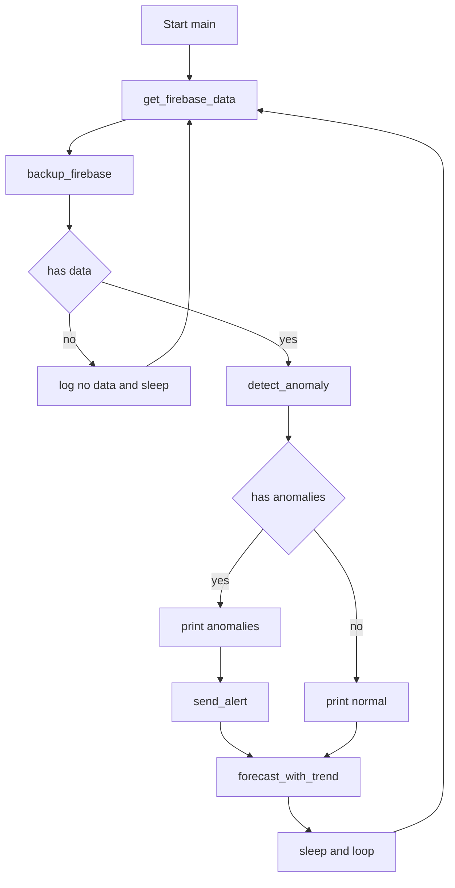

## Hệ thống giám sát chất lượng không khí với ESP32, Firebase và AI

Project này triển khai một hệ thống đo và giám sát chất lượng không khí theo thời gian thực dùng ESP32, lưu dữ liệu lên Firebase Realtime Database và một service Python bên ngoài để phân tích bất thường + dự báo, sau đó đẩy cảnh báo ngược lại về ESP32 hiển thị trên màn TFT.

---

## 1. Kiến trúc tổng thể

- **ESP32 (PlatformIO / Arduino)**:
  - Đọc cảm biến: DHT22 (nhiệt độ, độ ẩm), MQ135 (NH3), MQ7 (CO), GP2Y (bụi).
  - Hiển thị real-time lên TFT qua `TFT_eSPI`.
  - Gửi dữ liệu định kỳ lên Firebase bằng REST API.
  - Nhận cảnh báo bất thường từ service AI (Python) qua HTTP `/alert`, hiển thị cảnh báo trên TFT.
- **Firebase Realtime Database**:
  - Lưu log dữ liệu cảm biến theo timestamp (sensor_data).
- **Python AI Service (`backup_air_data.py`)**:
  - Chạy trên PC/server, định kỳ đọc dữ liệu từ Firebase.
  - Backup dữ liệu ra file `backup.json`.
  - Dùng **ECOD (PyOD)** để phát hiện bất thường đa biến và ngưỡng cố định để cảnh báo.
  - Dùng **Prophet** để dự báo 6 giờ tới cho từng biến (temp, humi, co, nh3, dust) và xác định xu hướng.
  - Gửi danh sách cảnh báo về ESP32 qua HTTP POST.

### 1.1. Sơ đồ kiến trúc (Mermaid)



---

## 2. Luồng chạy chi tiết firmware ESP32

Các file chính trong `src/`:
- `main.cpp`
- `Wifi_Config.h / Wifi_Config.cpp`
- `sensor.h / sensor.cpp`
- `display.h / display.cpp`
- `firebase.h / firebase.cpp`
- `backup_air_data.py` (service Python bên ngoài ESP32)

### 2.1. `setup()` và `loop()` – file `main.cpp`

```cpp
void setup()
{
  Serial.begin(9600);
  Wifi_init();
  AI_Start();
  MQ135_Init();
  MQ7_Init();
  GP2Y_setup();
  DHT22_init();
  TFT_init();
}

void loop()
{
  server.handleClient(); 

  if (!firstSendDone || millis() - lastSend > SEND_INTERVAL)
  {
    DHT22_run();
    MQ135_run();
    MQ7_run();
    dust = Run_GP2Y();
    drawScreen();
    sendToFirebase();
    lastSend = millis();
    firstSendDone = true;
  }
  delay(100);
}
```

- **setup()**:
  - Khởi tạo UART debug.
  - Gọi `Wifi_init()` để kết nối WiFi (ưu tiên WiFi mặc định, sau đó WiFi đã lưu, nếu không được thì chạy OFFLINE).
  - Gọi `AI_Start()` để khởi động HTTP server nhận cảnh báo AI (chỉ hoạt động khi WiFi đã kết nối).
  - Khởi tạo các cảm biến: `MQ135_Init()`, `MQ7_Init()`, `GP2Y_setup()`, `DHT22_init()`.
  - Khởi tạo màn hình TFT: `TFT_init()`.
- **loop()**:
  - `server.handleClient()` xử lý HTTP request (đặc biệt là `/alert` từ Python AI).
  - Theo chu kỳ `SEND_INTERVAL = 600000 ms` (10 phút) hoặc ngay lần đầu:
    - Đọc dữ liệu cảm biến: `DHT22_run()`, `MQ135_run()`, `MQ7_run()`, `Run_GP2Y()`.
    - Vẽ lại giao diện TFT: `drawScreen()`.
    - Gửi bản ghi mới lên Firebase: `sendToFirebase()`.

### 2.2. Luồng WiFi + AI Alert – `Wifi_Config.cpp / Wifi_Config.h`

- **Cấu hình thời gian**:
  - Dùng NTP: `pool.ntp.org`, GMT+7.
- **WiFi mặc định và Access Point**:
  - `ssid = "Open WorkShop 2.4GH"`
  - `password = "0000*0000"`
  - Có khai báo AP `ESP32_Config` nhưng trong mã hiện tại **không bật AP**, chỉ dùng STA.

#### 2.2.1. Hàm `Wifi_init()`

- Thứ tự thử kết nối:
  1. **WiFi mặc định** (`ssid`, `password`), retry tối đa 10 lần.
  2. Nếu thất bại: đọc `ssid`, `pass` từ `Preferences` namespace `"wifi"` và thử kết nối lại 10 lần.
  3. Nếu vẫn thất bại:
     - Đặt `wifiConnected = false`.
     - Log: chạy ở chế độ OFFLINE.
     - Tắt WiFi: `WiFi.mode(WIFI_OFF)`.
- Khi kết nối thành công:
  - `wifiConnected = true`.
  - In ra IP.
  - Gọi `configTime(...)` để đồng bộ NTP (phục vụ `getTimestamp()` trong Firebase).

#### 2.2.2. API nhận cảnh báo AI – `AI_Start()`

- Chỉ chạy nếu `wifiConnected == true`, ngược lại log: *AI Alert Server không khả dụng (WiFi offline)*.
- Đăng ký route:
  - `server.on("/alert", HTTP_POST, handler...)`
  - Body JSON (truyền từ Python) được parse bằng `ArduinoJson`.
  - Lấy `JsonArray anomalies = doc["anomalies"];`
  - Mỗi phần tử trong `anomalies` được đưa vào mảng vòng `receivedAlerts[10]` (tối đa 10 dòng gần nhất).
  - Trả HTTP `200 OK` nếu parse thành công.
- `server.begin()` và in log "AI Alert Server đã khởi động!".

**Biến trạng thái quan trọng**:
- `bool wifiConnected` – lưu trạng thái WiFi.
- `String receivedAlerts[10]`, `int receivedAlertCount` – buffer cảnh báo AI hiển thị trên TFT.
- Hàm tiện ích: `bool isWifiConnected()` kiểm tra lại trạng thái runtime (`wifiConnected` && `WiFi.status()`).

### 2.3. Đo cảm biến – `sensor.cpp / sensor.h`

- **Chân kết nối (theo mã)**:
  - DHT22: `DHTPIN 16`
  - MQ135 (NH3): `MQ135_PIN 34`
  - MQ7 (CO): `MQ7_PIN 32`
  - GP2Y (bụi): `GP2Y_ADC 33`, LED điều khiển: `GP2Y_LED 13`
- **Biến dùng chung giữa các module**:
  - `float temp, humi, co_ppm, nh3_ppm, dust;`

Tóm tắt xử lý:
- DHT22: đọc trực tiếp `temperature`, `humidity` và gán vào `temp`, `humi`.
- MQ135: đọc ADC nhiều mẫu, đổi ra điện áp, suy ra điện trở cảm biến, sau đó nội suy theo đường cong datasheet để ước lượng `nh3_ppm`.
- MQ7: tương tự MQ135, dùng hệ số khác để ước lượng `co_ppm`.
- GP2Y: điều khiển LED, đọc ADC trong nhiều chu kỳ ngắn, tính điện áp và chuyển sang mật độ bụi, quy đổi ra `dust` (µg/m³).

### 2.4. Hiển thị TFT – `display.cpp / display.h`

#### 2.4.1. Khởi tạo

- `TFT_eSPI tft;`
- `TFT_init()`:
  - `tft.init();`
  - `tft.setRotation(1);` (xoay ngang).

#### 2.4.2. Ngưỡng cảnh báo hiển thị

- `TEMP_HIGH = 35.0 °C`
- `HUMI_LOW = 30.0 %`
- `HUMI_HIGH = 90.0 %`
- `CO_HIGH = 12.5 ppm`
- `NH3_HIGH = 20.0 ppm`
- `DUST_HIGH = 35.0 µg/m³` (dùng ngưỡng trong Python).

- Hàm `collectWarnings(...)`:
  - Dựa trên các ngưỡng trên, sinh ra danh sách chuỗi cảnh báo:
    - `"HIGH TEMP!"`, `"ABN HUMI!"`, `"HIGH CO!"`, `"HIGH NH3!"`.

#### 2.4.3. Vẽ màn hình – `drawScreen()`

- Tính kích thước, chia màn hình thành 4 ô (2x2).
- Tập hợp cảnh báo:
  - `warnList` từ giá trị cảm biến.
  - `receivedAlerts` từ AI.
- Nền:
  - Nếu có bất cứ cảnh báo nào (`warnCount > 0` hoặc `receivedAlertCount > 0`) → nền **đỏ** (`TFT_RED`).
  - Ngược lại → nền **xanh** (`TFT_BLUE`) và in chữ "OK".
- Nội dung:
  - Góc trên trái: `TEMP`, `HUMI`.
  - Góc dưới: `CO`, `NH3`, `Dust`.
  - Nửa bên phải: danh sách cảnh báo:
    - Cảnh báo local (`warns[i]`).
    - Cảnh báo AI (`receivedAlerts[i]`).

### 2.5. Gửi dữ liệu lên Firebase – `firebase.cpp / firebase.h`

- **Biến thời gian**:
  - `unsigned long lastSend;`
  - `const unsigned long SEND_INTERVAL = 600000;` (10 phút).
  - `bool firstSendDone;`
- **Cấu hình Firebase**:
  - `firebase_host = "https://nckh-clkk-default-rtdb.asia-southeast1.firebasedatabase.app/";`
  - Đường dẫn chính: `sensor_data/<recordID>.json`.
- **Timestamp** – `getTimestamp()`:
  - Dùng `getLocalTime()` (thời gian đã sync NTP).
  - Format: `YYYY-MM-DD HH:MM:SS`.
- **`sendToFirebase()`**:
  - Sinh `recordID` từ `timestamp` (thay `space` bằng `_`, `:` bằng `-`).
  - Build JSON:
    - `"time"` – chuỗi timestamp.
    - `"temp"`, `"humi"`, `"co"`, `"nh3"`, `"dust"` – số thực 2 chữ số sau dấu phẩy.
  - Khi `WiFi.status() == WL_CONNECTED`:
    - Dùng `HTTPClient`, gửi `PUT` lên URL:
      - `firebase_host + "sensor_data/" + recordID + ".json"`.
    - In mã phản hồi (`code`) và JSON ra Serial.

---

## 3. Luồng chạy Python AI Service – `backup_air_data.py`

Script này **không chạy trên ESP32**, mà chạy trên PC/server, dùng `requests`, `pandas`, `prophet`, `pyod (ECOD)`, `numpy`.

### 3.1. Cấu hình chính

- `FIREBASE_URL = "<host>/sensor_data.json"`
- `ESP32_HTTP = "http://<ESP_IP>/alert"` – cần sửa IP thực tế của ESP32.
- `BACKUP_FILE = "backup.json"` – file backup local.
- `POLL_INTERVAL = 600` (10 phút).
- Ngưỡng cố định `THRESHOLDS` giống với ngưỡng trong ESP:
  - `temp`, `humi_low`, `humi_high`, `co`, `nh3`, `dust`.

### 3.2. Luồng chính `main()`

Pseudo-flow (rút gọn):



### 3.3. Các bước chính

- **Lấy & backup dữ liệu**:
  - Hàm `get_firebase_data()` đọc toàn bộ `sensor_data` từ Firebase, sort theo thời gian.
  - Hàm `backup_firebase(df)` lưu snapshot mới nhất vào `backup.json` (kèm `_last_backup`).
- **Phát hiện bất thường**:
  - `detect_anomaly(df)` dùng cả:
    - Ngưỡng cố định cho từng biến (`THRESHOLDS`).
    - Mô hình ECOD (PyOD) để phát hiện bất thường đa biến trên điểm mới nhất.
  - Trả về danh sách `anomalies` (chuỗi mô tả) và bản ghi `latest_row`.
- **Dự báo & xu hướng**:
  - `forecast_with_trend(df, col)` huấn luyện Prophet trên chuỗi thời gian từng biến.
  - Dự báo 6 điểm tiếp theo (6 giờ) và suy ra xu hướng tăng / giảm / ổn định.
- **Gửi cảnh báo về ESP32**:
  - `send_alert(anomalies, latest_row)` đóng gói JSON gồm loại cảnh báo, thời gian và giá trị đo.
  - Gửi HTTP POST tới `/alert` trên ESP32; firmware nhận và hiển thị trên TFT qua `receivedAlerts[]`.

---

## 4. Hướng dẫn build & run

### 4.1. ESP32 firmware (PlatformIO)

- **Yêu cầu**:
  - PlatformIO (VSCode / CLI).
  - Board: `nodemcu-32s` (ESP32).
- **Cấu hình chính** – `platformio.ini`:
  - `platform = espressif32`
  - `board = nodemcu-32s`
  - `framework = arduino`
  - Thư viện:
    - `DHT sensor library`
    - `TFT_eSPI`
    - `PubSubClient`
    - `ArduinoJson`
- **Build & Upload**:
  - Mở project trong PlatformIO.
  - Chọn environment `env:nodemcu-32s`.
  - `Build` → `Upload` firmware lên ESP32.
- **Cần chỉnh**:
  - Thông số WiFi mặc định trong `Wifi_Config.cpp` nếu bạn không dùng `Open WorkShop 2.4GH`.
  - Hoặc cấu hình WiFi đã lưu bằng `Preferences` (phần này đang lưu/đọc key `"wifi"` – `ssid`, `pass`).

### 4.2. Python AI service

- Tạo virtualenv (hoặc dùng `airenv` đang có).
- Cài đặt package (tối thiểu):
  - `requests`, `pandas`, `numpy`, `prophet`, `pyod`.
- Chỉnh:
  - `FIREBASE_URL` trùng với Firebase của bạn.
  - `ESP32_HTTP` = `http://<IP thực tế của ESP32>/alert`.
- Chạy:
  ```bash
  python src/backup_air_data.py
  ```
  Script sẽ:
  - Vừa dự đoán, vừa phát hiện bất thường.
  - Ghi log ra console.
  - Gửi HTTP POST tới ESP32 khi phát hiện bất thường.

---

## 5. Tóm tắt luồng dữ liệu end-to-end

1. ESP32 khởi động:
   - Kết nối WiFi (nếu được) và sync NTP.
   - Khởi tạo HTTP server `/alert`, cảm biến, TFT.
2. Mỗi 10 phút:
   - Đọc DHT22, MQ135, MQ7, GP2Y.
   - Cập nhật màn hình TFT (màu nền xanh/đỏ + cảnh báo local/AI).
   - Gửi mẫu mới lên Firebase (một JSON / một timestamp).
3. Python service:
   - Kéo toàn bộ `sensor_data` từ Firebase.
   - Backup ra `backup.json` (kèm `_last_backup` và timestamp).
   - Dùng **ngưỡng cố định + ECOD** để phát hiện bất thường.
   - Dùng **Prophet** để dự báo 6h tới và đánh giá xu hướng.
   - Nếu bất thường:
     - Gửi danh sách `anomalies` về ESP32 qua `/alert`.
4. ESP32 nhận cảnh báo:
   - Parse JSON.
   - Lưu vào `receivedAlerts[10]`.
   - Lần vẽ màn hình tiếp theo, hiển thị cảnh báo AI ở nửa phải, chuyển nền sang đỏ nếu có cảnh báo.

Như vậy toàn bộ pipeline từ cảm biến → ESP32 → Firebase → Python AI → ESP32 được đóng vòng khép kín, cho phép vừa giám sát real-time tại chỗ, vừa phân tích sâu và cảnh báo thông minh dựa trên lịch sử dữ liệu.
